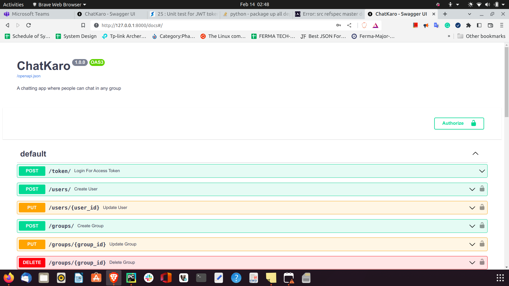
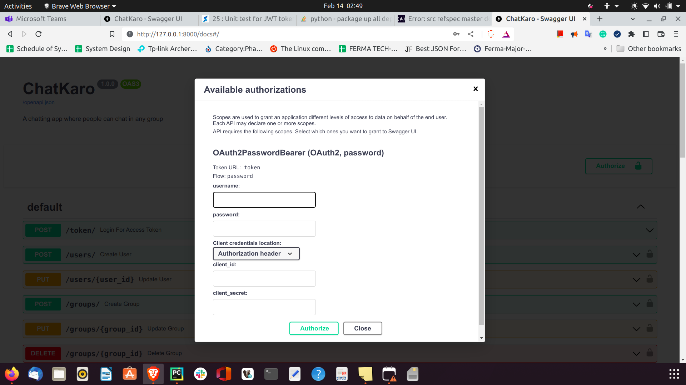
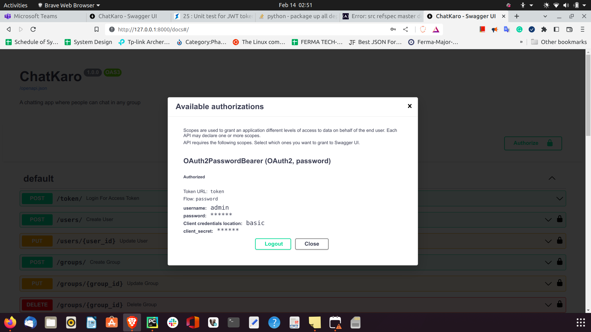
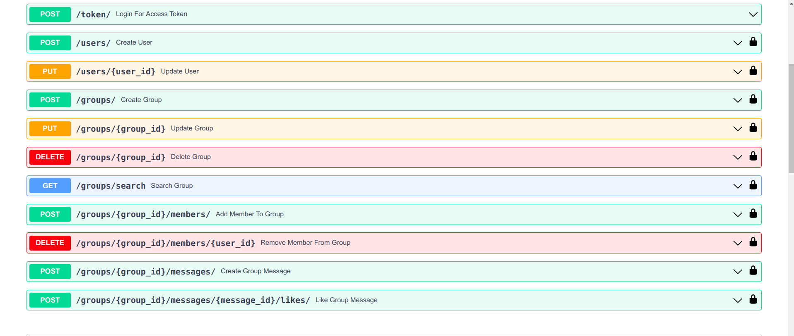

# ChatKaro

A fastAPI chatting app is a digital platform or application that enables users to communicate with each other through
written
text messages. These apps provide a user-friendly interface that allows individuals to chat one-on-one or in groups with
other users in real-time.

## Installation

Steps:

1. Clone this project in local
2. Create virtual env
3. Install all the requirements from requirements.txt using below command in virtual env
   **pip install -r requirements.txt**
4. Replace the SECRET_KEY in config.py. Use the below command to generate the secret key
   **openssl rand -hex 32**
5. Use the database of your choice. I have provided SQLALCHEMY_DATABASE_URL for MySql and sqlite db. In case you want to
   use MySql, replace username and password. In case of sqlite, no username and password required. You can make changes
   in db_handler.py file.

## Functional test

To run functinal test cases. Follow
Steps:

1. Open terminal
2. Go to project directory
3. Activate virtual env using command :   **. {virtual_env_name}/bin/activate**
4. use **pytest** command to run functional test cases.

## Run application

1. Open terminal
2. Go to project directory
3. Activate virtual env using command :   **. {virtual_env_name}/bin/activate**
4. Run **python main.py** to start server
5. Goto http://127.0.0.1:8000/docs to open swaggerUI and play with your chat application

A admin username and password added to database by default  
**username: admin**  
**password: admin**

Authorize using the above credentials and use different endpoints to create, delete, add [users,groups,message,likes]
 Click on Authorize

Enter admin credentials

You are Authorize to access endpoints

Close the current pop up window, and access different endpoints!

Note: Create, edit user endpoints are only accessible to admin only
And all other api such as create, delete [groups,message] etc are accessible only to normal user, so create a new user
and then use these endpoints 
Login,token are common to admin and normal user

## License

Information about the project's license, including any restrictions or permissions for use

## Contact

Instructions for how to get in touch with the project's maintainers or developers
